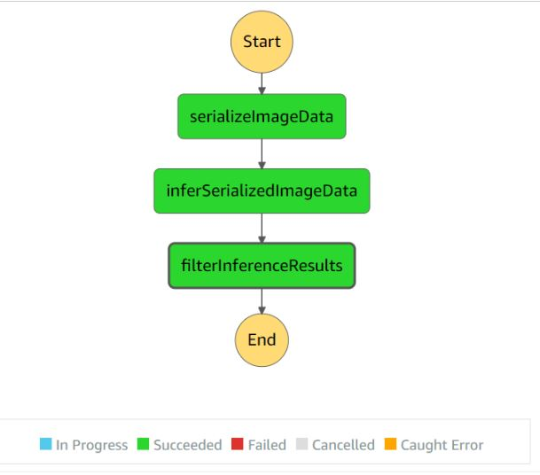

# Deploy and monitor a ML workflow for Scones Unlimited

## Overview
The motive of the project is to build a Machine Learning Model that performs image classification through ML workflows using Amazon's Sage Maker. The Step Functions 
linked with the lambda scripts are used to automate various tasks of Machine Learning process from Data Preparation, Model Creation, Model Deployment and Inference.

### Dependencies

Python 3.8
scikit-learn latest

1. The [Serialize Image Data Lambda Function](lambda%20functions/serializedImage.py) takes the address of an image hosted in S3, then serializes and returns a JSON
object.
2. The [Infer Serialized Image Data](lambda%20functions/infer_serializedImage.py) takes the JSON object returned from 1 and passes it to an end point and collectd the result
as a JSON Object.
3. The [Filter Results Lambda Function](lambda%20functions/filter_Results.py) takes the inference data from 2 and filters only the images that meet the defined threshold.  

## Step Functions Graph
 
## Step Function Output

