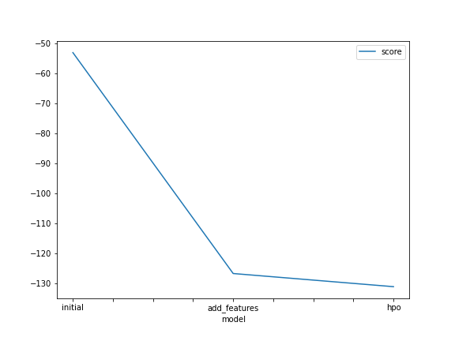
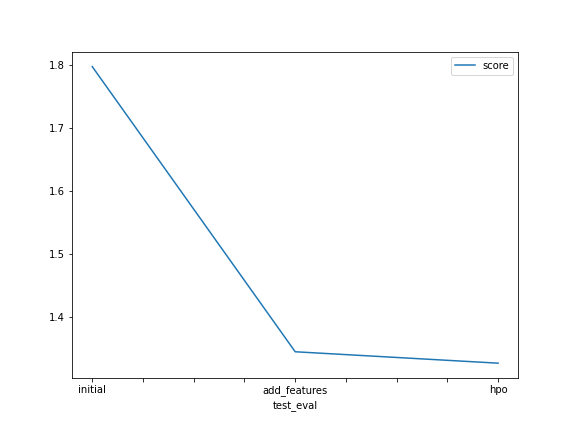

# Report: Predict Bike Sharing Demand with AutoGluon Solution
#### YUSRA SHEREEN

## Initial Training
### What did you realize when you tried to submit your predictions? What changes were needed to the output of the predictor to submit your results?
The first time when I used the raw dataset without perfoming any data analysis or feature engineering the model did not perfomed as well as expected bescause it had a lot of error, In order to be able to submit my results to kaggle I needed to replace the negative numbers with 0

### What was the top ranked model that performed?
WeightedEnsemble_L3 model

## Exploratory data analysis and feature creation
### What did the exploratory analysis find and how did you add additional features?
For the extra features I divided the datetime in month, day, year and hour. Also it was usefull to transform the season and weather features to categorical

### How much better did your model perform after adding additional features and why do you think that is?
Because additional features can be good predictors to estimate the target value. In this case, the date is separated and it helps the model to analyse seasonality paterns in the data, which are useful for regression

## Hyper parameter tuning
### How much better did your model preform after trying different hyper parameters?
Hyper parameter tuning is usefull in some cases but for this project it just slightly improved model performance by reducing the rsme

### If you were given more time with this dataset, where do you think you would spend more time?
Trying different hyperparameters to get more better results

### Create a table with the models you ran, the hyperparameters modified, and the kaggle score.
|model|num_bag_folds|num_bag_sets|num_stack_levels|score|
|--|--|--|--|--|
|initial|default|default|default| 1.79030|
|add_features|default|default|default|1.34659|
|hpo|5|1|1|1.34451|

### Create a line plot showing the top model score for the three (or more) training runs during the project.

### Create a line plot showing the top kaggle score for the three (or more) prediction submissions during the project.

## Summary
In this project 3 different models are trained using AutoGluon to predict bike sharing demand, 1st with data, 2nd with additional features, and 3rd with hyper parameter tuning. The predictions of each model is submitted to bike sharing demand kaggle competition. The model with hyper parameter tuning scored best.
